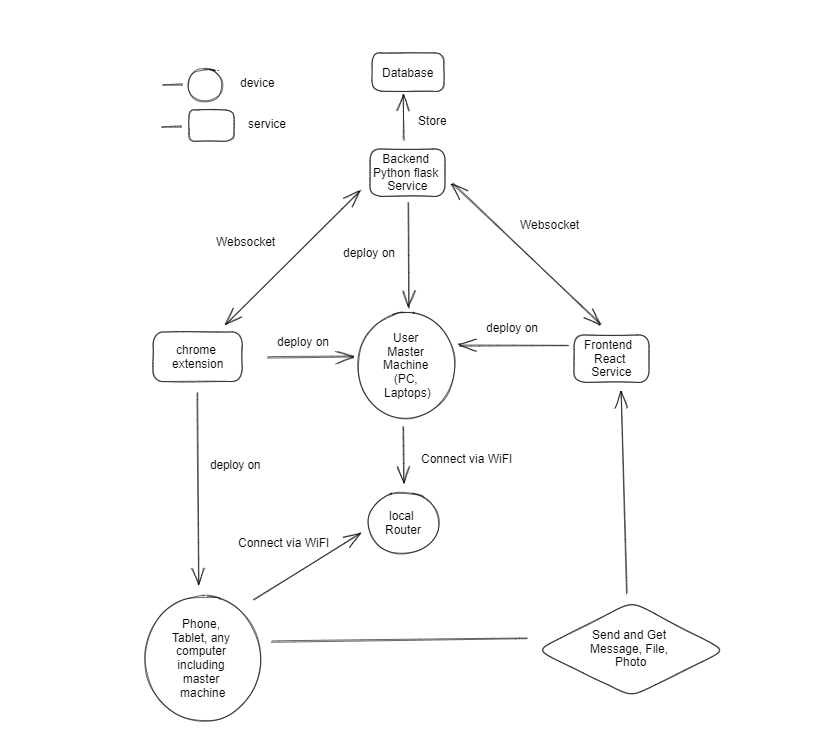

# Airdrop BackEnd

## Intro

Airdrop project allows user to transmit message, photo, and file among any devices that has access to browser. It is only based on household router, and therefore need no access to public internet and the transmission should be fast. This is the backEnd project for Airdrop project.

## System Design




## Run This project

1. install dependencies

   ```
   pip install -r requirement.txt

   ```
2. Run project

   ```
   python app.py 
   ```
